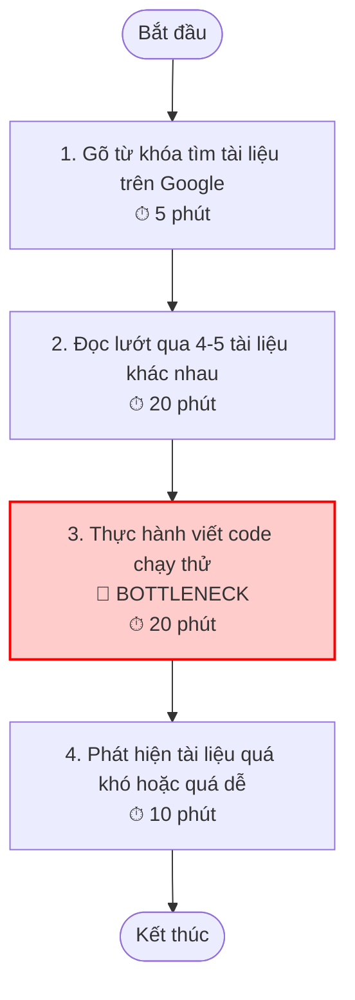
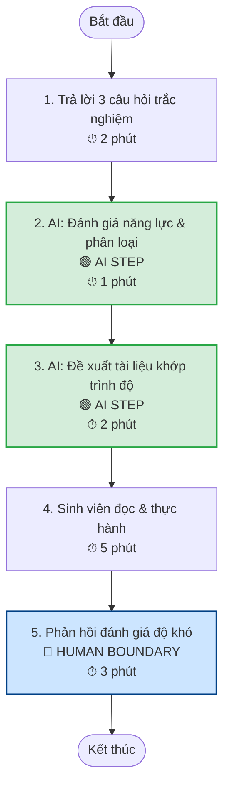
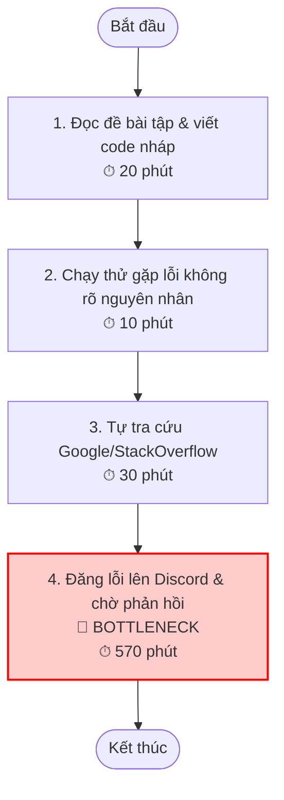
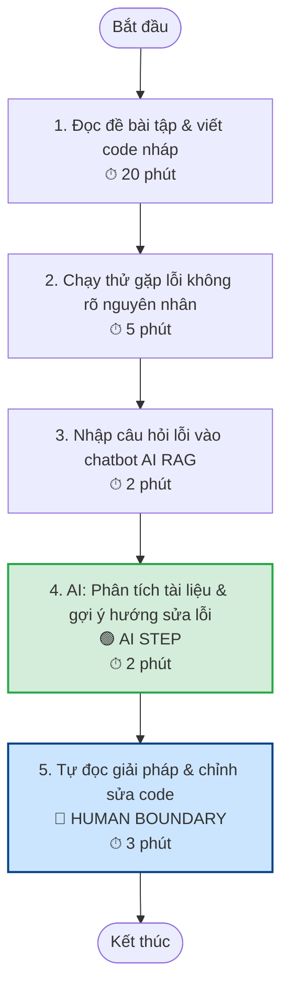
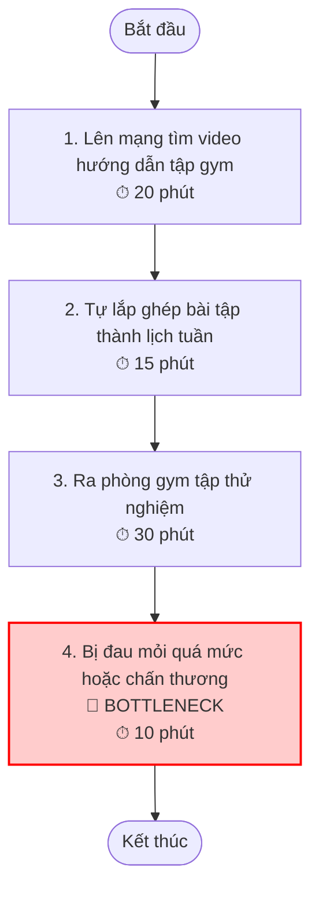
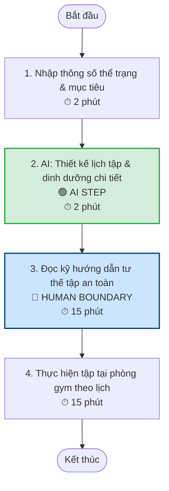
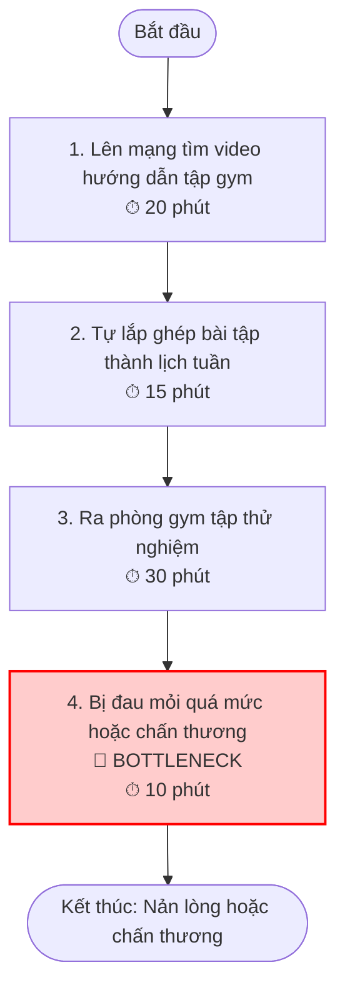
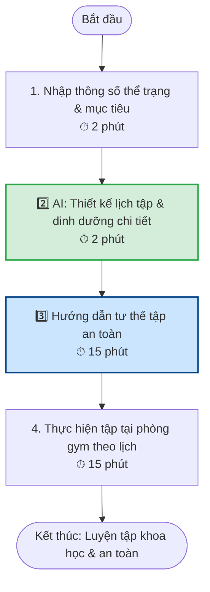

# 01 — Individual Problem Scan
**Mã Học Viên:** 2A202600631  
**Họ Và Tên:** Phạm Hoàng Anh  

---

## 1. Bảng Quét Rộng 5+ Problems
*Dưới đây là danh sách 9 vấn đề thực tế được quét từ trải nghiệm học tập, sinh hoạt tại VinUni và đời sống hàng ngày.*

| # | Lăng kính | Problem quan sát được | Ai đang đau? | Dấu hiệu thật |
|---|---|---|---|---|
| 1 | Pain từ người khác | Chưa có người hỗ trợ trực tiếp giải đáp bài tập trên phòng học mọi lúc mọi nơi (24/7) khi sinh viên làm bài ban đêm. | Sinh viên AI20k, người tự học | Bị nghẽn bài làm lúc 11-12h đêm, phải đợi hôm sau hỏi TA/Giảng viên. |
| 2 | Lặp lại | Chưa có công cụ tổng hợp và tìm kiếm nhanh các món ăn giá rẻ, ngon quanh khu vực trường học (Gia Lâm). | Sinh viên nội trú, ngoại trú | Mất 15-20 phút mỗi trưa/tối thảo luận nhóm "Hôm nay ăn gì rẻ?" rải rác trên các app. |
| 3 | Tốn thời gian | Học giao tiếp tiếng Anh khó, thiếu môi trường luyện tập hội thoại tự nhiên theo ngữ cảnh thực tế hàng ngày. | Sinh viên VinUni, người học ngoại ngữ | Ngại nói, phát âm chưa chuẩn, mất nhiều tháng học ngữ pháp nhưng giao tiếp vẫn ngập ngừng. |
| 4 | Tốn thời gian | Chưa sắp xếp và tối ưu hóa được thời gian biểu cá nhân hợp lý giữa việc học, bài tập nhóm và hoạt động ngoại khóa. | Sinh viên, người đi làm | Cảm giác luôn bận rộn nhưng trễ deadline, lịch chồng chéo, mất 30 phút mỗi tuần lên lịch thủ công. |
| 5 | AI có thể tốt hơn | Tìm kiếm tài liệu, lộ trình học AI đúng cấp độ (Beginner/Intermediate/Advanced) của bản thân khó giữa ma trận thông tin. | Sinh viên ngành AI, người tự học | Đọc tài liệu quá khó gây nản lòng hoặc tài liệu quá dễ gây tốn thời gian; mất cả tiếng tìm kiếm. |
| 6 | Lặp lại | Chưa thiết lập được bài tập Gym bài bản và chế độ dinh dưỡng phù hợp với thể trạng và cấp độ sức bền hiện tại. | Người mới tập gym, sinh viên | Tập sai tư thế, tập theo các bài trên mạng không phù hợp gây chấn thương hoặc không đạt hiệu quả. |
| 7 | Tốn thời gian | Chọn thời điểm tốt nhất và tuyến đường tối ưu để di chuyển từ trường về nội thành Hà Nội nhanh hơn, tránh tắc đường. | Sinh viên ngoại trú, giảng viên | Bị kẹt xe 1-1.5 tiếng vào giờ cao điểm thứ Sáu; các app bản đồ chưa tích hợp tốt lịch xe buýt/shuttle bus trường. |
| 8 | AI có thể tốt hơn | Tìm kiếm kiểu tóc phù hợp nhất với khuôn mặt, sở thích cá nhân, phong cách thời trang và điều kiện thời tiết theo mùa. | Bản thân sinh viên, người trẻ | Cắt hỏng tóc tại tiệm, tốn 20-30 phút tự tra cứu ảnh mẫu trên mạng nhưng không thực tế với chất tóc của mình. |

---

## 2. Top 3 Problem Cards

Dưới đây là **Top 3 vấn đề khả thi nhất, dễ giải quyết và cực kỳ thuận tiện để triển khai dự án nhóm 5 người** dựa trên mức độ sẵn có của dữ liệu và tính phù hợp với AI:

---

**Chi tiết Card #1 (Học liệu AI cá nhân hóa):**
* **Problem 1 câu:** Sinh viên tự học AI mất nhiều giờ liền tìm kiếm và chọn lọc tài liệu học tập đúng với cấp độ năng lực hiện tại của mình.
* **Actor:** Sinh viên ngành Trí tuệ nhân tạo, người tự học công nghệ.
* **Bối cảnh:** Khi bắt đầu một chương mới (ví dụ: học về Transformers, Fine-tuning) trước kỳ thi hoặc nghiên cứu.
* **Quy trình hiện tại (Current Workflow):**
  1. Gõ từ khóa tìm kiếm tài liệu trên Google/YouTube.
  2. Đọc lướt qua 4-5 tài liệu/video khác nhau để tự đánh giá xem mình có hiểu không.
  3. Thử thực hành viết code theo tài liệu.
  4. Nhận ra tài liệu quá khó (thiếu kiến thức nền) hoặc quá dễ (không học thêm được gì mới), dẫn đến nản lòng và phải tìm lại từ đầu.
* **Bottleneck:** Bước 2 & 4 — Tự đánh giá mức độ khó của tài liệu và mức độ phù hợp với bản thân cực kỳ mơ hồ và tốn thời gian (trung bình mất 45 phút/chủ đề).
* **Impact:** Lãng phí thời gian tự học, dễ bỏ cuộc giữa chừng, học lệch kiến thức nền tảng.
* **Success Metric:** Giảm thời gian tìm học liệu chuẩn xuống dưới 10 phút; tỷ lệ sinh viên đánh giá tài liệu "đúng trình độ" đạt trên 85%.
* **Non-AI alternative:** Danh sách học liệu cố định (Syllabus tĩnh) chia sẵn mức độ, nhưng nhược điểm là không cập nhật tự động các bài viết mới và không cá nhân hóa theo điểm yếu cụ thể của từng sinh viên.
* **AI hypothesis:** AI đóng vai trò làm "Người đánh giá năng lực nhanh" thông qua 3 câu hỏi trắc nghiệm đầu vào, sau đó tự động phân loại người dùng (Beginner/Intermediate/Advanced) và đề xuất danh sách bài đọc/video được gán thẻ độ khó tương xứng.
* **Quick gut:** **Workflow** (Hệ thống điều phối tuyến tính: Nhận input -> Đánh giá phân loại -> Trích xuất đề xuất).

### Draft current workflow

### Draft future workflow

> [!NOTE]
> **Fallback:** Nếu AI đề xuất không đúng trình độ, sinh viên sẽ quay lại tự lọc tài liệu thủ công.

---

**Chi tiết Card #2 (Trợ lý học tập 24/7 chuyên biệt cho phòng học):**
* **Problem 1 câu:** Sinh viên bị tắc nghẽn khi tự làm bài tập lập trình vào ban đêm và phải mất nhiều tiếng chờ đợi đến sáng hôm sau để nhận hỗ trợ từ trợ giảng (TA).
* **Actor:** Sinh viên tham gia các lớp học công nghệ, lập trình.
* **Bối cảnh:** Tự học và làm bài tập lớn tại nhà/ký túc xá sau 10h đêm.
* **Quy trình hiện tại (Current Workflow):**
  1. Đọc đề bài tập và viết code nháp.
  2. Chạy thử nghiệm và gặp lỗi (bug) không rõ nguyên nhân.
  3. Tự tra cứu trên StackOverflow hoặc Google nhưng không tìm thấy trường hợp khớp với bài giảng của thầy.
  4. Đành chụp ảnh màn hình gửi lên Discord lớp học và đợi trợ giảng phản hồi vào sáng hôm sau.
* **Bottleneck:** Bước 4 — Thời gian chờ đợi phản hồi từ con người quá lâu (mất 8 đến 12 tiếng), làm gián đoạn mạch tư duy và tiến độ nộp bài.
* **Impact:** Sinh viên nộp bài muộn, giảm chất lượng học tập, gây áp lực trả lời tin nhắn dồn dập cho các TA.
* **Success Metric:** 95% câu hỏi cơ bản về bài tập/lỗi cú pháp được giải đáp ngay lập tức dưới 1 phút với câu trả lời chính xác, bám sát tài liệu bài giảng.
* **Non-AI alternative:** Tuyển thêm nhiều trợ giảng trực đêm (tốn kém chi phí lớn cho trường và không thực tế).
* **AI hypothesis:** Dựng một chatbot RAG (Retrieval-Augmented Generation) được huấn luyện trên tài liệu bài giảng, syllabus và các lỗi thường gặp của khóa học để giải thích bài tập và gợi ý sửa lỗi code (không cho chép code trực tiếp, chỉ định hướng tư duy).
* **Quick gut:** **Workflow** (Quy trình RAG: Nhận câu hỏi -> Tìm kiếm ngữ cảnh trong tài liệu -> Sinh câu trả lời định hướng).

### Draft current workflow

### Draft future workflow

> [!NOTE]
> **Fallback:** Nếu AI giải thích không hiểu hoặc đi sai hướng, sinh viên sẽ đăng lỗi lên Discord lớp học để TA hỗ trợ thủ công.

---

**Chi tiết Card #3 (Lịch trình Gym cá nhân hóa):**
* **Problem 1 câu:** Người mới đi tập gym không biết thiết kế lịch tập và bài tập phù hợp với thể trạng hiện tại dẫn đến tập luyện không hiệu quả hoặc chấn thương.
* **Actor:** Sinh viên, người trẻ mới bắt đầu tập luyện thể hình.
* **Bối cảnh:** Khi mới đăng ký thẻ tập tại phòng gym của trường hoặc phòng gym ngoài.
* **Quy trình hiện tại (Current Workflow):**
  1. Lên YouTube/TikTok tìm kiếm các video hướng dẫn bài tập gym.
  2. Tự lắp ghép các bài tập rời rạc thành một lịch tập tuần.
  3. Ra phòng gym tập thử nghiệm.
  4. Gặp tình trạng đau mỏi quá mức (quá tải), tập sai nhóm cơ mục tiêu hoặc chấn thương nhẹ do bài tập quá nặng so với thể trạng.
* **Bottleneck:** Bước 2 & 4 — Thiết kế lịch tập thiếu khoa học, không khớp với sức bền cơ bắp hiện tại.
* **Impact:** Người tập nản lòng bỏ cuộc sau 2-3 tuần, tốn tiền mua thẻ tập nhưng không có kết quả, chấn thương cơ khớp.
* **Success Metric:** Có ngay một lịch tập chi tiết, an toàn trong vòng 2 phút; tỷ lệ người tập duy trì lịch tập trên 1 tháng đạt > 80%.
* **Non-AI alternative:** Thuê huấn luyện viên cá nhân (PT) với chi phí cực kỳ đắt đỏ (khoảng 5-10 triệu/tháng), vượt quá khả năng tài chính của sinh viên.
* **AI hypothesis:** AI thu thập dữ liệu về: chiều cao, cân nặng, mục tiêu (tăng cơ/giảm mỡ), số buổi tập/tuần và trang thiết bị hiện có của phòng gym, sau đó tự động thiết kế lộ trình tập chi tiết từng ngày kèm hướng dẫn kỹ thuật.
* **Quick gut:** **Workflow** (Hệ thống chuyển đổi dữ liệu thể trạng thành lịch trình có cấu trúc).

### Draft current workflow

### Draft future workflow

> [!NOTE]
> **Fallback:** Nếu lịch tập AI gợi ý quá nặng hoặc người tập thấy đau khớp chấn thương, người tập sẽ chủ động giảm mức tạ hoặc tham khảo ý kiến chuyên gia/PT phòng gym.

---

## 3. Bản Sơ Đồ Quy Trình (Draft Workflow Before/After) cho Card muốn Pitch nhất (Lịch trình Gym cá nhân hóa - Card #3)

Dưới đây là sơ đồ quy trình tối ưu hóa cho **Card #3 - Thiết kế lịch trình Gym cá nhân hóa** bằng sơ đồ **Mermaid** trực quan sinh động:

### **CURRENT STATE (Quy trình trước khi áp dụng AI) — Tổng thời gian: 75 phút**

---

### **FUTURE STATE (Quy trình sau khi có sự tham gia của AI) — Tổng thời gian: 34 phút**

