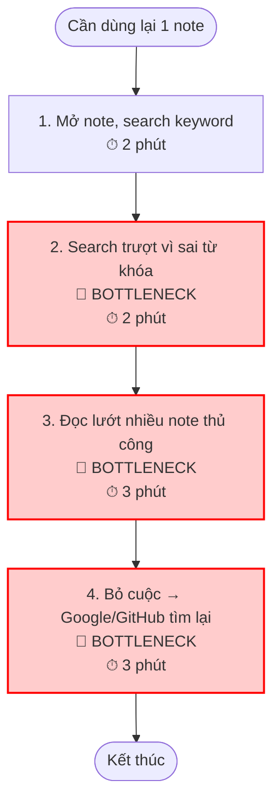
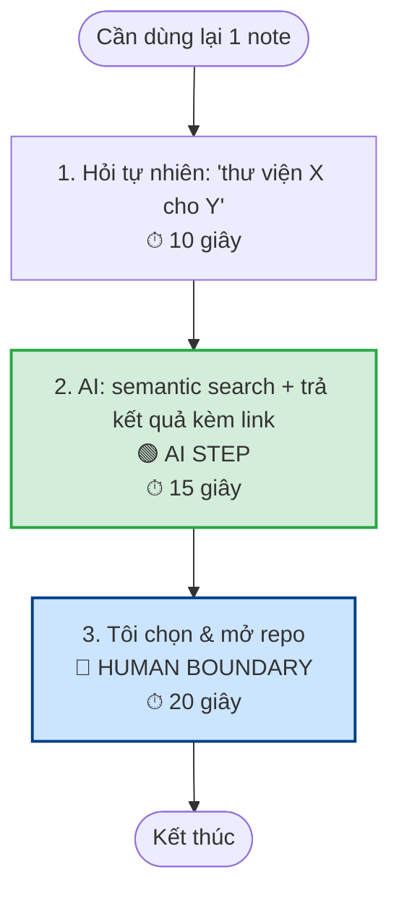
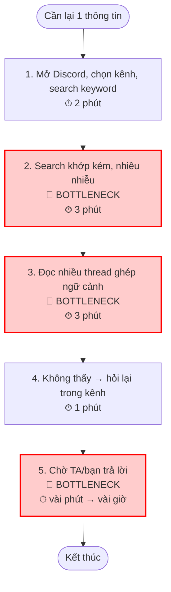
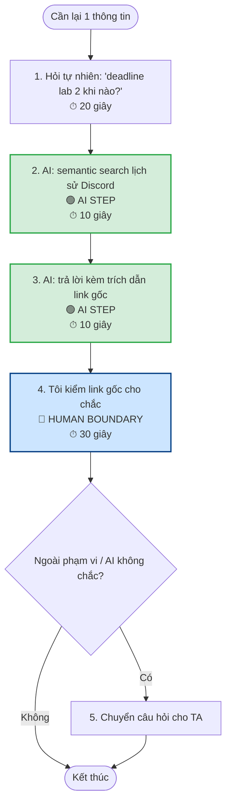
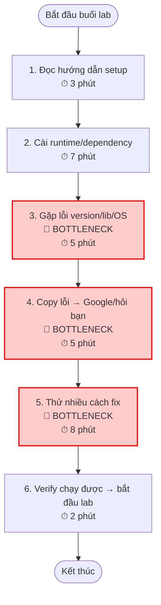
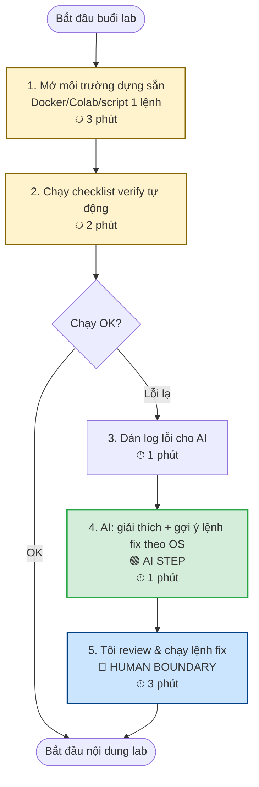

# 01 — Individual Problem Scan
**Mã Học Viên:** 2A202601008
**Họ Và Tên:** Đỗ Dương Việt Anh


---

## 1. Bảng Quét Rộng (10 Problems)

*Quét từ trải nghiệm học tập, làm việc và thói quen theo dõi công nghệ hằng ngày.*

| # | Lăng kính | Problem quan sát được | Ai đang đau? | Dấu hiệu thật |
|---|---|---|---|---|
| 1 | Tốn thời gian / AI tốt hơn | Kho note công nghệ (framework/library/tin GitHub-FB) trong app note mobile phình to, không cấu trúc, không tìm theo ngữ nghĩa được → khi cần dùng lại rất khó tìm | Bản thân tôi; các bạn dev hay lưu note tản mạn | ~5–15 phút/lần tìm lại; phần lớn note không bao giờ dùng lại ("note chết") |
| 2 | Lặp lại / Pain người khác | Tìm lại quyết định/câu trả lời cũ của GV/TA trong Discord lớp đã trôi mất → phải hỏi lại câu đã có đáp án | SV trong lớp; TA (phải trả lời lại) | ~10–15 phút/lần; nhiều SV cùng gặp; câu hỏi lặp trong kênh |
| 3 | Tốn thời gian | Tự setup môi trường (cài đặt, dependency, config) + debug lỗi trước mỗi buổi lab/dự án mới | SV làm lab; người mới onboard | ~20–40 phút/buổi, đôi khi cả buổi; thời gian lab ngắn nên trễ nội dung chính |
| 4 | Tốn thời gian / AI tốt hơn | Tổng hợp tài liệu dài để học/ôn — bị chặn vì không tải được PDF để nạp vào NotebookLM | SV trước deadline | tài liệu dài; mất thời gian đọc & tóm tắt thủ công; tool bị chặn input |
| 5 | Lặp lại | Mất tập trung khi học/làm sâu — chỉ ~30 phút là tâm trí phân tán sang việc khác | Bản thân tôi | chu kỳ tập trung ~30 phút; nhiều lần/ngày; kéo dài thời gian hoàn thành |
| 6 | Tốn thời gian | Trì hoãn task phức tạp cần kiến thức rộng để hiểu vấn đề & xác định giải pháp | Bản thân tôi | trì hoãn vài giờ→vài ngày trước khi bắt đầu task khó |
| 7 | Lặp lại / Pain người khác | App điểm danh phức tạp, hay lỗi | Cả lớp; người vận hành | lỗi lặp mỗi buổi; tốn thời gian thao tác lại |
| 8 | AI có thể tốt hơn | Lượng kiến thức nhiều, thời gian lab ngắn → khó biết học gì trước, ưu tiên ra sao | SV trong khóa | cảm giác quá tải; không có lộ trình ưu tiên rõ |
| 9 | Pain từ người khác | Chênh lệch tốc độ tiếp thu trong lớp đa độ tuổi; lớp đông khó theo sát từng người | SV tiếp thu chậm hơn; GV/TA | một số bạn bị bỏ lại; cần chia nhóm nhỏ |
| 10 | Lặp lại / Tốn thời gian | Theo dõi framework/library mới liên tục nhưng không có cách triage → lưu rồi quên, không bao giờ thử lại | Bản thân tôi | lưu nhiều, dùng lại rất ít; bỏ lỡ công cụ hữu ích |

> **Vì sao loại khỏi top 3:** #5, #6 (tập trung, trì hoãn) khó vẽ workflow + khó đo + AI-fit mờ. #7 (app điểm danh) là lỗi kỹ thuật/UX → giải pháp non-AI hợp hơn. #9 quá rộng (vấn đề giáo vụ). #4, #10 cùng cụm "tổng hợp & truy vấn tri thức" với #1.

---

## 2. Top 3 Problem Cards

Chọn theo: actor rõ · workflow vẽ được · bottleneck cụ thể · impact đo được · so sánh được Rule/Workflow/Agent · không quá rộng cho 1 buổi lab.

---

### Card #1 — Kho note công nghệ cá nhân khó truy vấn

* **Problem 1 câu:** Khi cần dùng lại một framework/library/tin công nghệ đã lưu, tôi mất nhiều thời gian lục trong kho note mobile vì note rời rạc, không cấu trúc, không tìm theo ngữ nghĩa được — nhiều note thành "kiến thức chết".
* **Actor:** Bản thân tôi — SV ngành công nghệ/AI hay theo dõi GitHub/Facebook/news; mở rộng: các bạn dev lưu note tản mạn.
* **Bối cảnh:** Lúc lưu (lướt thấy repo hay → ghi nhanh vào note); lúc cần (vài tuần/tháng sau, làm dự án cần đúng công cụ đó).
* **Quy trình hiện tại (Current Workflow):**
  1. Thấy repo/tin hay khi lướt GitHub/FB.
  2. Copy link + gõ vài chữ mô tả vào note mobile.
  3. (Khi cần) Mở note, scroll hoặc search keyword.
  4. Không nhớ chính xác từ khóa đã ghi → search trượt.
  5. Đọc lướt nhiều note để tìm đúng cái cần.
  6. Bỏ cuộc → quay lại Google/GitHub tìm lại từ đầu.
* **Bottleneck:** Bước 4–6 — khâu truy vấn lại; search chỉ khớp keyword chính xác, không hiểu ngữ nghĩa.
* **Impact:** ~5–15 phút/lần tìm, vài lần/tuần; phần lớn note không bao giờ dùng lại; đôi khi quên đã lưu → tìm lại từ đầu, bỏ lỡ công cụ hữu ích.
* **Success Metric:** Thời gian tìm đúng note từ ~10 phút → dưới 1 phút; tăng tỷ lệ note được mở/dùng lại trong 30 ngày. Đo bằng bấm giờ 10 lần tìm gần nhất + đếm số lần phải quay ra Google.
* **Non-AI alternative:** Chuẩn hóa format note (`Tên | Category | Công dụng | Link | Tag`) + bộ tag cố định + app full-text search tốt (Notion/Obsidian). Đủ phần lớn **nếu** kỷ luật lúc lưu.
* **AI hypothesis:** Lúc lưu: AI tự tóm tắt + gắn tag + lấy metadata repo. Lúc tìm: hỏi ngôn ngữ tự nhiên, AI semantic search trả về kèm link. Người vẫn xác nhận.
* **Quick gut:** **Workflow** (Rule chuẩn hóa lúc lưu + AI semantic search lúc tìm).

#### Current workflow (~10 phút mỗi lần tìm)



#### Future workflow (dưới 1 phút mỗi lần tìm)



> [!NOTE]
> **Lúc lưu:** AI tự tóm tắt + gắn tag để khỏi phụ thuộc kỷ luật tay.
> **Fallback:** AI không chắc → trả về top-N note gần đúng để tôi tự lọc (không tự ý xóa/sửa note của tôi).

---

### Card #2 — Tìm lại quyết định/câu trả lời cũ trong Discord lớp

* **Problem 1 câu:** Khi cần lại thông tin/quyết định mà GV/TA đã trả lời trước đó trong Discord, tôi mất thời gian cuộn và search nhưng tin nhắn đã trôi, dẫn đến hỏi lại câu đã có đáp án và chờ phản hồi.
* **Actor:** SV trong lớp A20 (lớp đông, nhiều kênh); bên cũng đau: TA phải trả lời câu lặp.
* **Bối cảnh:** Trong/sau buổi học, cần lại deadline, cách nộp, cách fix lỗi, hoặc quyết định về bài tập.
* **Quy trình hiện tại (Current Workflow):**
  1. Nhớ mang máng đã có người hỏi/được trả lời.
  2. Mở Discord, chọn kênh, gõ keyword search.
  3. Search khớp keyword kém → nhiều nhiễu hoặc không thấy.
  4. Đọc nhiều thread để ghép ngữ cảnh.
  5. Không thấy → đăng hỏi lại trong kênh.
  6. Chờ TA/bạn trả lời.
* **Bottleneck:** Bước 3–6 — search kém + đọc thread + hỏi lại + chờ. Thông tin có nhưng không truy xuất lại kịp.
* **Impact:** ~10–15 phút/lần; nhiều SV cùng gặp; người hỏi bị kẹt chờ; TA quá tải vì câu lặp.
* **Success Metric:** Thời gian tìm lại từ ~12 phút → dưới 2 phút; giảm tỷ lệ câu hỏi trùng lặp. Đo bằng bấm giờ + đếm câu hỏi lặp trong kênh 1–2 tuần.
* **Non-AI alternative:** Pin câu quan trọng + FAQ doc/Notion + quy ước phân kênh. Giảm đáng kể nhưng cần người duy trì, không bao phủ hết.
* **AI hypothesis:** AI semantic search trên lịch sử Discord, trả lời kèm **trích dẫn link tin nhắn gốc**; câu ngoài phạm vi/không chắc → chuyển TA.
* **Quick gut:** **Workflow** (Rule cho FAQ cố định + AI search có trích dẫn; TA duyệt câu phức tạp).

#### Current workflow (~12 phút + thời gian chờ)



#### Future workflow (dưới 2 phút)



> [!NOTE]
> **Fallback:** AI không chắc/ngoài phạm vi → bắt buộc chuyển TA, không tự bịa đáp án; mọi câu trả lời phải có trích dẫn link gốc.

---

### Card #3 — Setup môi trường lab mất thời gian

* **Problem 1 câu:** Mỗi khi bắt đầu một lab/dự án mới, tôi mất nhiều thời gian tự setup môi trường và debug lỗi trước khi bắt tay vào nội dung chính — trong khi thời gian lab vốn đã ngắn.
* **Actor:** SV làm lab; người mới onboard dự án.
* **Bối cảnh:** Đầu mỗi buổi lab, hoặc khi clone dự án/notebook mới về máy cá nhân (mỗi máy/OS một kiểu).
* **Quy trình hiện tại (Current Workflow):**
  1. Đọc hướng dẫn setup.
  2. Cài runtime/dependency theo hướng dẫn.
  3. Gặp lỗi (version mismatch, thiếu lib, khác OS, biến môi trường...).
  4. Copy lỗi → Google/StackOverflow/hỏi bạn.
  5. Thử nhiều cách fix cho tới khi chạy.
  6. Verify chạy được → mới bắt đầu nội dung lab.
* **Bottleneck:** Bước 3–5 — debug lỗi môi trường; "ăn" mất thời gian đáng lẽ dành cho nội dung chính.
* **Impact:** ~20–40 phút/buổi, đôi khi cả buổi nếu lỗi khó; gắn trực tiếp với pain "thời gian lab ngắn".
* **Success Metric:** Thời gian setup tới khi chạy được từ ~30 phút → dưới 10 phút; giảm số buổi bị trễ vì lỗi môi trường. Đo bằng bấm giờ phần setup vài buổi gần nhất + đếm số buổi trễ.
* **Non-AI alternative (rất mạnh):** Môi trường dựng sẵn — Docker/devcontainer, Google Colab, hoặc script cài 1 lệnh — kèm checklist + danh sách lỗi thường gặp. Đây là giải pháp tối ưu cho phần lớn case vì kết quả cố định, dự đoán được.
* **AI hypothesis:** Với lỗi lạ ngoài checklist: AI đọc log → giải thích nguyên nhân + gợi ý lệnh fix theo đúng OS/ngữ cảnh. AI chỉ hỗ trợ debug, không thay phần dựng sẵn.
* **Quick gut:** **Rule** là chính (Docker/Colab/script) + một bước **Workflow** nhẹ (AI hỗ trợ debug lỗi lạ).

#### Current workflow (~30 phút)



#### Future workflow (dưới 10 phút)



> [!NOTE]
> Ô vàng = Rule (môi trường dựng sẵn xử lý phần lớn). **Fallback:** AI gợi ý fix không hiệu quả → quay về hướng dẫn gốc / hỏi TA. Không auto-chạy lệnh AI gợi ý mà chưa review.

---

## 3. Workflow Before/After — Card muốn pitch nhất (Card #1)

**Kho note công nghệ:** từ **~10 phút/lần tìm → dưới 1 phút** (xem 2 sơ đồ Mermaid ở Card #1).

| Tiêu chí | Trước | Sau (kỳ vọng) | Thay đổi |
|---|---:|---:|---|
| Thời gian tìm lại 1 note | ~10' | < 1' | -90% |
| Bước thủ công | search + đọc lướt thủ công | chỉ chọn kết quả | giảm |
| Bottleneck | truy vấn (search trượt) | — (chuyển sang chọn lọc) | ✅ |
| Risk mới | không | AI tóm tắt/gợi ý sai → cần người xác nhận | cần boundary |

---

## 4. Phản biện (đóng vai Skeptical PM) — tự kiểm trước khi pitch

Mỗi card tự "đánh" theo 6 câu hỏi: actor rõ? workflow thật? bottleneck rõ? metric đo được? Rule/process đã đủ chưa? có nhảy sang Agent quá sớm?

**Card #1 — Kho note công nghệ**
- *"Pain này đủ lớn chưa, hay chỉ 5–15 phút/lần?"* → Impact thật không chỉ là thời gian mà là **note chết** (kiến thức/công cụ bị bỏ lỡ). Cần đo tần suất tìm/tuần thật để chứng minh đủ lớn — nếu tần suất thấp thì có thể chưa đáng làm.
- *"Rule + format chuẩn + Obsidian đã đủ chưa, sao cần AI?"* → Thừa nhận: phần lớn giải bằng Rule. AI chỉ thêm giá trị ở **semantic search** (hỏi theo ý nghĩa) + auto-tag để không phụ thuộc kỷ luật tay. Nếu mình kỷ luật lúc lưu → Rule đủ → có thể **No-Go cho AI**.
- *"Metric 'note dùng lại' đo kiểu gì?"* → Khó đo trực tiếp; đề xuất đo gián tiếp: số lần mở lại note trong 30 ngày + số lần vẫn phải Google dù đã có note.
- *"Có nhảy sang Agent quá sớm không?"* → Không — chỉ Workflow. Agent (tự fetch repo, monitor liên tục) là overkill, thêm chi phí/rủi ro vô ích.

**Card #2 — Tìm lại thông tin Discord**
- *"Quyền truy cập lịch sử Discord — khả thi không?"* → Đây là **rủi ro lớn nhất**: cần bot có quyền đọc lịch sử + vấn đề privacy. Nếu không có quyền → quyết định **Not Yet**.
- *"Pin + FAQ doc (Rule) đã giải 70–80% câu lặp chưa?"* → Có thể đủ cho câu lặp phổ biến; AI chỉ thật cần cho câu chưa từng pin. Phải so sánh trước khi chọn Workflow.
- *"AI trả sai thông tin lớp (vd deadline sai) thì sao?"* → Risk cao → bắt buộc **trích dẫn link gốc** + người tự kiểm; câu quan trọng vẫn để TA chốt.
- *"Trùng case bài giảng (TA quá tải)?"* → Đúng — phải nêu rõ **góc nhìn riêng (người đi tìm tin)** để không bị coi là chép ví dụ mẫu.

**Card #3 — Setup môi trường**
- *"Đây có thật là bài toán AI không, hay chỉ cần Docker/Colab (Rule)?"* → Chính xác, và đây là **điểm mạnh**: dám nói AI chỉ hỗ trợ lỗi lạ. Nếu trường cấp sẵn môi trường chuẩn → gần như **No-Go cho AI** (Rule thắng).
- *"AI gợi ý lệnh fix sai → chạy hỏng môi trường/máy?"* → Risk thật → bắt buộc **người review trước khi chạy**, không auto-exec lệnh AI.
- *"Lỗi môi trường đa dạng, AI có đủ context máy người dùng?"* → Hạn chế: cần người dán đủ log + OS; AI có thể đoán sai → fallback về hướng dẫn gốc/TA.

> **Kết luận phản biện:** Cả 3 card đều **không nên nhảy lên Agent**. Card #1, #2 → Workflow (AI hỗ trợ 1–2 bước, người kiểm). Card #3 → Rule là chính, AI chỉ phụ. Điểm yếu cần làm rõ trước khi pitch: tần suất thật (Card #1), quyền truy cập dữ liệu (Card #2), và việc Rule có thể đã đủ (cả #1 và #3).

---

## 5. Card muốn pitch nhất + câu hỏi cho nhóm

**Card muốn pitch nhất:** *(gợi ý: Card #1 — pain cá nhân, đo được, khác ví dụ mẫu. Bạn TỰ chốt theo bài bạn tự tin diễn đạt nhất.)*

**Vì sao:**
```
Đây là pain tôi gặp thật mỗi tuần, có workflow rõ và đo được bằng thời gian tìm lại 
note + tỷ lệ note dùng lại. Nó cũng khác với ví dụ mẫu (weekly report) nên dễ thể hiện
"scan từ trải nghiệm thật", và so sánh được cả 3 mức Rule / Workflow / Agent.
```

**Câu hỏi tôi muốn nhóm challenge:**
```
- "Note được dùng lại" đo khách quan thế nào (đánh dấu note đã mở/dùng trong 1 tháng)?
- Chỉ cần chuẩn hóa format + tag + app search tốt (Rule) đã đủ chưa, có thật cần AI semantic search không?
```
